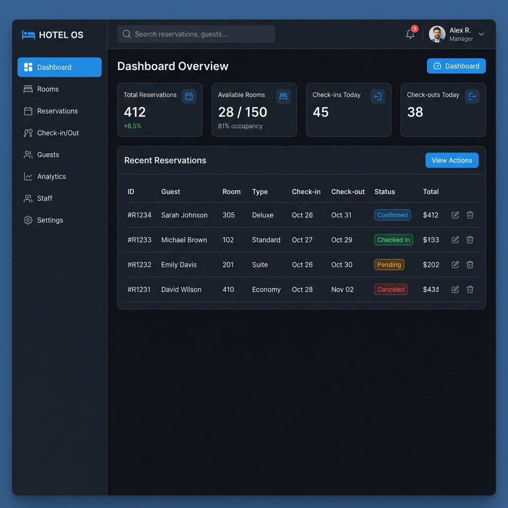

# Antalya Hotel Management System

A modern, full-stack React web application built for boutique and mid-sized hotels. The project includes both a **public-facing customer website** (for browsing rooms and making reservations) and a **secure admin dashboard** (for managing rooms, reservations, and daily operations).



## Features

### Public Website
- **Modern Landing Page**: High-quality UI with dynamic hero sections and hotel highlights.
- **Room Browsing**: Filter and view available rooms with detailed descriptions and images.
- **Reservation System**: Seamless booking process for customers.
- **User Authentication**: Customers can register and log in to track their reservations.

### Admin Panel
- **Dashboard**: Quick overview of daily stats, occupancy rates, and pending tasks.
- **Room Management**: Add, update, or remove rooms, and change their statuses (Available, Occupied, Cleaning).
- **Reservation Tracking**: Approve, reject, or modify incoming reservations.
- **Check-in / Check-out**: A dedicated module for receptionists to handle daily check-ins and check-outs effortlessly.

## Tech Stack

- **Frontend**: React 18, Vite, React Router v7
- **Styling**: Vanilla CSS with modern flexbox/grid layouts and CSS animations
- **Backend / Database**: Firebase Firestore (Real-time NoSQL database)
- **State Management**: React Context API
- **Icons**: Tabler Icons

## Getting Started

Follow these instructions to get a local copy of the project up and running.

### Prerequisites
- Node.js (v18 or higher recommended)
- A Firebase account (if you plan to connect your own database)

### Installation

1. Clone the repository:
   ```bash
   git clone https://github.com/yourusername/AntalyaHotelSystems.git
   cd AntalyaHotelSystems
   ```

2. Install dependencies:
   ```bash
   npm install
   ```

3. Configure Firebase:
   Update `src/firebase.js` with your own Firebase project configuration. (Offline persistence is enabled by default for faster local caching).

4. Run the development server:
   ```bash
   npm run dev
   ```

5. Open [http://localhost:5173](http://localhost:5173) to view the public site.
   - To access the admin panel, navigate to `/admin/login`.
   - Default admin credentials: `admin@hotel.com` / `admin123`

## Project Structure

```text
src/
├── components/   # Reusable UI components (admin & public)
├── context/      # Global state (HotelContext, AuthContext)
├── data/         # Mock data for initial database seeding
├── layouts/      # Main page wrappers (AdminLayout, PublicLayout)
├── pages/        # Route components separated by domain
├── routes/       # Protected route wrappers
└── index.css     # Global styles and design tokens
```

## Performance Note
The application utilizes Firebase's **Offline Persistence** (IndexedDB). Initial page loads will cache the Firestore database locally, allowing subsequent visits and page navigation to execute with near-zero latency while synchronizing changes in the background.

## License
Distributed under the MIT License.
